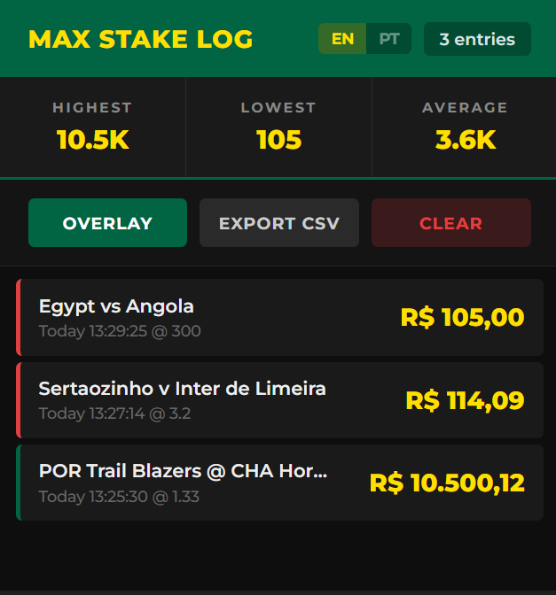
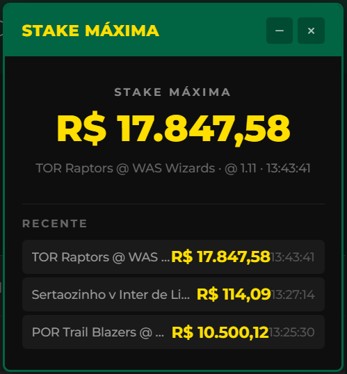

# 💰 Max Stake Monitor — Firefox

A Firefox extension that captures and displays maximum stake values from bookmaker API responses — no more digging through DevTools.

> Looking for the Chrome version? → [max-stake-monitor](https://github.com/doinp9/max-stake-monitor)





## Features

* **Passive interception** — reads API responses already flowing through your browser, never sends extra requests
* **On-page overlay** — draggable, minimizable widget showing the current max stake in real time
* **Persistent log** — stores up to 500 entries across sessions with match name, odds, and timestamp
* **Stats dashboard** — highest, lowest, and average max stake at a glance
* **CSV export** — download your full history with timestamps in BRT (Brasília Time)
* **Color-coded entries** — green (high liquidity), yellow (average), red (low liquidity) relative to your average
* **Extension badge** — clean static icon, no clutter
* **Bilingual** — toggle between English and Portuguese (EN/PT)
* **All markets** — works with moneyline, draw, over/under, spreads, and any other market type
* **Privacy first** — all data stays local in browser storage, nothing is sent anywhere

## How It Works

The extension uses a multi-layered interception strategy to capture bet confirmation responses:

1. **`JSON.parse` interception** — patches the global `JSON.parse` to inspect every parsed object for the `bt[].ms` pattern. This is the most reliable method since all JSON responses must pass through it regardless of how the HTTP request was made.
2. **`XMLHttpRequest` patching** — intercepts XHR `open`/`send` to monitor responses containing max stake data.
3. **`fetch` patching** — wraps the Fetch API to clone and inspect responses.
4. **`Response.prototype` patching** — intercepts `.json()` and `.text()` methods as a final safety net.

When a matching response is found, the extension deep-searches the JSON for the `ms` (Max Stake) field and extracts match information from fields like `la[].fd` for the event name and `bt[0].re` for the odds.

## Color System

Entries are color-coded relative to your **average** max stake:

| Color | Condition | Meaning |
| --- | --- | --- |
| 🟢 Green | ≥ 1.5× average | High liquidity market |
| 🟡 Yellow | Between | Normal range |
| 🔴 Red | ≤ 0.5× average | Low liquidity / potentially limited |

## Install

1. Download or clone this repository
2. Open Firefox and go to `about:debugging#/runtime/this-firefox`
3. Click **Load Temporary Add-on**
4. Select the `manifest.json` file from this folder
5. Visit your bookmaker — enjoy!

> **Note:** Temporary add-ons are removed when Firefox restarts. For permanent install, the extension needs to be signed via [addons.mozilla.org](https://addons.mozilla.org).

## Project Structure

```
max-stake-monitor-firefox/
├── manifest.json    # Firefox extension manifest (Manifest V3 + Gecko)
├── injected.js      # Page-context interceptor (JSON.parse, XHR, fetch)
├── content.js       # Overlay UI + script injection bridge
├── popup.html       # Log viewer panel
├── popup.js         # Log rendering, i18n, export
├── background.js    # Background script (persistent storage)
├── icons/
│   ├── icon48.png
│   └── icon128.png
├── LICENSE
└── PRIVACY.md
```

## CSV Export Format

| Column | Example |
| --- | --- |
| Timestamp (BRT) | `2026-02-28T10:42:08 BRT` |
| Max Stake (BRL) | `6615.03` |
| Match | `POR Trail Blazers @ CHA Hornets` |
| Odds | `1.31` |

## Disclaimer

This tool is for personal research and educational purposes. It passively reads HTTP responses in your own browser — equivalent to manually using browser DevTools. No data is scraped, automated, or sent to external servers. Users are responsible for compliance with their bookmaker's terms of service.

## Contributing

Pull requests welcome.

## License

MIT License — see [LICENSE](LICENSE)
